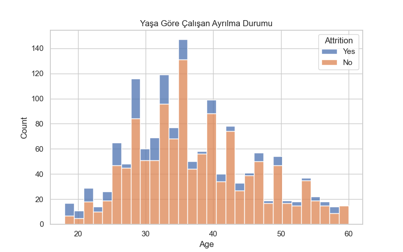
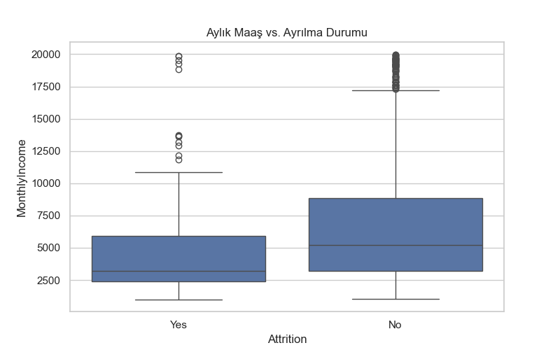
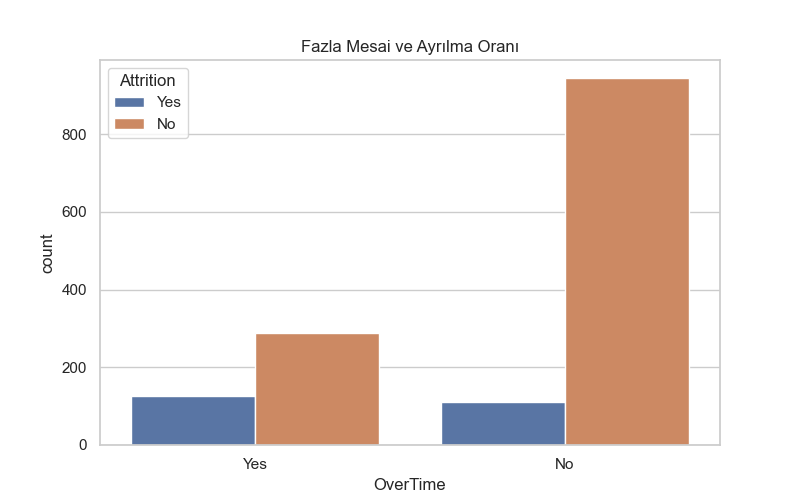

# HR Attrition Prediction / Çalışan Kaybı Tahmini

## 📌 Proje Hakkında / About the Project
Bu proje, çalışanların işten ayrılma olasılıklarını tahmin etmek için geliştirilmiş bir makine öğrenmesi projesidir. Amaç, İnsan Kaynakları (HR) departmanlarının potansiyel çalışan kaybını önceden belirleyerek stratejik kararlar almasını sağlamaktır.

This project is designed to predict employee attrition using machine learning. The goal is to help HR departments identify employees likely to leave and take proactive measures.

---

## 🧰 Kullanılan Teknolojiler / Technologies
- Python 3
- Pandas, NumPy
- Scikit-learn, XGBoost
- Matplotlib, Seaborn
- Joblib (model kaydetme ve yükleme)

---

## 📊 Veri Analizi ve Görselleştirme / Exploratory Data Analysis
Veri setindeki sütunlar arasında yaş, departman, pozisyon, maaş, fazla mesai gibi özellikler bulunmaktadır.

### Örnek Görselleştirmeler:
- Yaşa göre ayrılma durumu  


- Aylık maaş ve ayrılma ilişkisi  


- Fazla mesai ve ayrılma oranı  


> Bu görselleştirmeler, hangi faktörlerin çalışan kaybına etkisi olduğunu anlamamıza yardımcı oldu.

---

## 💻 Model Eğitimi / Model Training
Projede kullanılan modeller:
1. Logistic Regression  
2. Random Forest  
3. Gradient Boosting  
4. XGBoost  

Tüm modeller için pipeline oluşturuldu ve veriler sayısal ve kategorik olarak ön işlemden geçirildi.

### Model Karşılaştırması / Model Comparison
Tüm modeller `accuracy_score` ve `classification_report` ile değerlendirildi.  
En yüksek doğruluk skoruna sahip model belirlendi ve GridSearchCV ile hiperparametre optimizasyonu yapıldı.

### GridSearch ile Hiperparametre Optimizasyonu / Hyperparameter Tuning
En iyi modeli optimize etmek için `GridSearchCV` kullanıldı.  
Örnek parametreler (Logistic Regression için):

```python
param_grid = {
    "model__C": [0.01, 0.1, 1, 10],
    "model__penalty": ["l2"],
    "model__solver": ["lbfgs", "liblinear"]
}

## Proje Dosya Yapısı / Project Structure
10-Model Eğitim Projem/
├─ 1-Model Eğitimi.py
├─ 2-Model İçin Tahmin Üretme.py
├─ HR_Model.pkl
├─ README.md
├─ images/
│   ├─ age_attrition.png
│   ├─ monthly_income_attrition.png
│   └─ overtime_attrition.png
